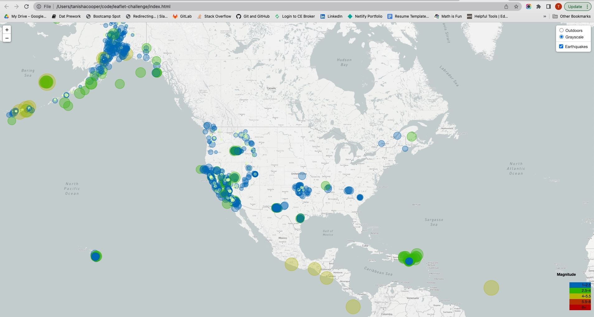
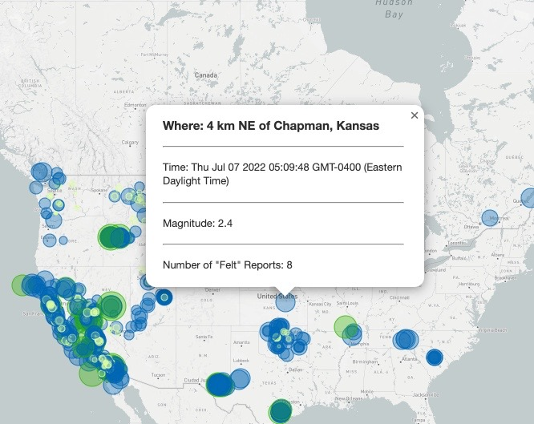
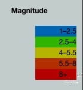

# leaflet-challenge

# Visualization of Earthquakes with Leaflet

## Deployment Link
- [HTML Deployed](https://tanishacooper.github.io/leaflet-challenge/)

## Background
The  **United States Geological Survey**, or USGS for short, is responsible for providing scientific data about natural hazards, the health of our ecosystems and environment, and the impacts of climate and land-use change. Their scientists develop new methods and tools to supply timely, relevant, and useful information about the Earth and its processes. As a new hire, I will be helping them out with an exciting new project!

The USGS is interested in building a new set of tools that will allow them to visualize their earthquake data. They collect a massive amount of data from all over the world each day, but they lack a meaningful way of displaying it. Their hope is that being able to visualize their data will allow them to better educate the public and other government organizations (and hopefully secure more funding) on issues facing our planet.

## Use Cases
- Educate general public and goverment organizations about earthquakes and issues facing our planet
- Secure more funding

## Challenge Configuration
There are two parts to the challenge, as Part 2 is optional. You will be able to visualize the earthquake data. The two views: **Outdoor** and **Streetmap** launch successfully.

- Part 1: Create the Earthquake Visualization
- Part 2: Gather and Plot More Data (Optional)

### Leaflet Part 1: Create the Earthquake Visualization

1. Dataset
    - Review and select datasets from [USGS GeoJSON Feed](https://earthquake.usgs.gov/earthquakes/feed/v1.0/geojson.php)
    - Data updates every 5 minutes. Selected [dataset](https://earthquake.usgs.gov/earthquakes/feed/v1.0/summary/all_week.geojson) that traces all earthquakes from past 7 days 
    - Study JSON
    
    

2. Import and visualize the data by doing the following:

    - Using Leaflet, create a map that plots all the earthquakes from your dataset based on their longitude and latitude.

    - Your data markers should reflect the magnitude of the earthquake by their size and the depth of the earthquake by color. Earthquakes with higher magnitudes should appear larger, and earthquakes with greater depth should appear darker in color.

    **Hint:** The depth of the earth can be found as the third coordinate for each earthquake.

    - Include popups that provide additional information about the earthquake when its associated marker is clicked.

    

    - Create a legend that will provide context for your map data.

    

- Part 2: Gather and Plot More Data (Optional)

### Leaflet Part 2: Gather and Plot More Data (Optional)

The USGS wants you to plot a second dataset on your map to illustrate the relationship between tectonic plates and seismic activity. So, you will need to pull in this dataset and visualize it alongside your original data. Data on tectonic plates can be found at <https://github.com/fraxen/tectonicplates>.

The following image is an example screenshot of what the USGS would like you to produce:

Perform the following tasks: 

* Plot the tectonic plates dataset on the map in addition to the earthquakes.

* Add other base maps to choose from.

* Put each dataset into separate overlays that can be turned on and off independently.

* Add layer controls to our map.

---
#### Copyright
Tanisha Cooper ©2022. All Rights Reserved.